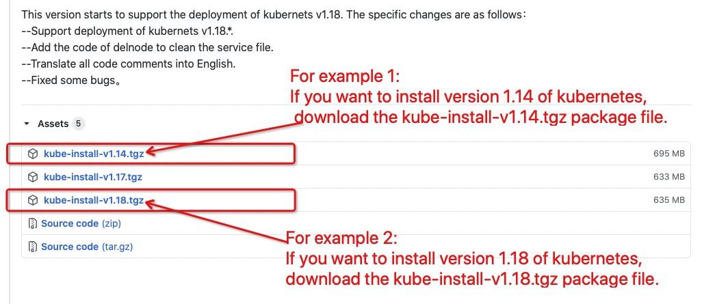
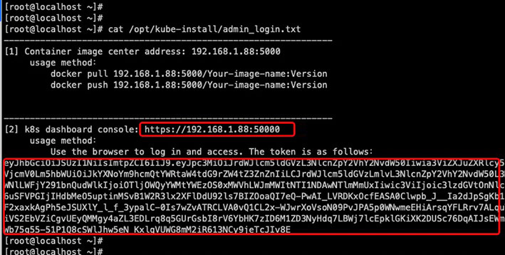

One click fast installation of highly available kubernetes cluster, as well as addition of kubernetes node, deletion of kubernetes node, destruction of kubernetes master and rebuild of kubernetes master in later operation and maintenance stage.
<br>


<br>

# [1] Corresponding relation

<br>
Kube-install and kubernetes version correspondence:
<table>
<tr><td>kube-install Version</td><td>Installation package to download</td><td>Supported installed versions</td>
<tr><td> kube-install v0.1.* </td><td> kube-install-pkg-1.14.tgz</td><td> Install kubernetes v1.14.* </td></tr>
<tr><td> kube-install v0.2.* </td><td> kube-install-pkg-1.14.tgz</td><td> Install kubernetes v1.14.* </td></tr>
<tr><td> kube-install v0.3.* </td><td> kube-install-v1.14.tgz</td><td> Install kubernetes v1.14.* </td></tr>
<tr><td> kube-install v0.3.* </td><td> kube-install-v1.15.tgz</td><td> Install kubernetes v1.15.* </td></tr>
<tr><td> kube-install v0.3.* </td><td> kube-install-v1.16.tgz</td><td> Install kubernetes v1.16.* </td></tr>
<tr><td> kube-install v0.3.* </td><td> kube-install-v1.17.tgz</td><td> Install kubernetes v1.17.* </td></tr>
<tr><td> kube-install v0.3.* </td><td> kube-install-v1.18.tgz</td><td> Install kubernetes v1.18.* </td></tr>
<tr><td> kube-install v0.4.* </td><td> kube-install-v1.14.tgz</td><td> Install kubernetes v1.14.* </td></tr>
<tr><td> kube-install v0.4.* </td><td> kube-install-v1.15.tgz</td><td> Install kubernetes v1.15.* </td></tr>
<tr><td> kube-install v0.4.* </td><td> kube-install-v1.16.tgz</td><td> Install kubernetes v1.16.* </td></tr>
<tr><td> kube-install v0.4.* </td><td> kube-install-v1.17.tgz</td><td> Install kubernetes v1.17.* </td></tr>
<tr><td> kube-install v0.4.* </td><td> kube-install-v1.18.tgz</td><td> Install kubernetes v1.18.* </td></tr>
<tr><td> kube-install v0.4.* </td><td> kube-install-v1.19.tgz</td><td> Install kubernetes v1.19.* </td></tr>
</table>
<br>
Note: for a list of supported operating system distributions, please refer to <a href="docs/os-support.md">OS support list</a>.
<br>
<br>
<br>

# [2] How to install?

<br>

If you have four servers,kubernetes master software is installed on the three servers (192.168.1.11, 192.168.1.12, 192.168.1.13), and kubernetes node software is installed on the four servers (192.168.1.11, 192.168.1.12, 192.168.1.13, 192.168.1.14). <br>

<table>
<tr><td>IP Address</td><td>Role</td><td>OS Version</td><td>Root Password</td></tr>
<tr><td>192.168.1.11</td><td>k8s-master,k8s-node</td><td>CentOS Linux release 7 or Red Hat Enterprise Linux(RHEL) 7</td><td>cloudnativer</td></tr>
<tr><td>192.168.1.12</td><td>k8s-master,k8s-node</td><td>CentOS Linux release 7 or Red Hat Enterprise Linux(RHEL) 7</td><td>cloudnativer</td></tr>
<tr><td>192.168.1.13</td><td>k8s-master,k8s-node</td><td>CentOS Linux release 7 or Red Hat Enterprise Linux(RHEL) 7</td><td>cloudnativer</td></tr>
<tr><td>192.168.1.14</td><td>k8s-node</td><td>CentOS Linux release 7 or Red Hat Enterprise Linux(RHEL) 7</td><td>cloudnativer</td></tr>
</table>
You expect the architecture after installation to be as follows:


<br>

## 2.1 Download kube-install package file

<br>
You can download the `kube-install-*.tgz` package from https://github.com/cloudnativer/kube-install/releases. <br>



If you want to install version 1.18 of kubernetes, download the `kube-install-v1.18.tgz` package file.If you want to install version 1.17 of kubernetes, download the `kube-install-v1.17.tgz` package file.If you want to install version 1.16 of kubernetes, download the `kube-install-v1.16.tgz` package file...In the same way, you can download the version you want.<br>

For example, we are now installing kubernetes v1.18, and we have downloaded the `kube-install-v1.18.tgz` package.<br>


```
# cd /root/
# wget https://github.com/cloudnativer/kube-install/releases/download/v0.3.2/kube-install-for-k8s1.18-v0.3.2.tgz
# tar -zxvf kube-install-for-k8s1.18-v0.3.2.tgz
# cd /root/kube-install/
```

<br>

## 2.2 Initialize system environment

<br>
Please operate in the root user environment. Perform the system environment initialization operation on the k8s-master selected above: <br>

```
# cd /root/kube-install/
# ./kube-install -opt init
```

<br>

## 2.3 Install kubernetes cluster

<br>
Please operate in the root user environment. Execute on the k8s-master selected above:<br>

```
# cd /root/kube-install/
# ./kube-install -opt install -master "192.168.1.11,192.168.1.12,192.168.1.13" -node "192.168.1.11,192.168.1.12,192.168.1.13,192.168.1.14" -mvip "192.168.1.88" -sshpwd "cloudnativer"
```

Note: in the above command, the `-mvip` parameter is the kubernetes cluster virtual IP address.So you need to assign the kubernetes cluster a virtual IP address on the same LAN as the k8s-master.
<br>
<br>
<br>

## 2.4 Login kubernetes dashboard UI

<br>
Execute the following command on the k8s-master you selected to view the kube-dashboard console URL and key:<br>

```
# cat /opt/kube-install/admin_login.txt
```




Login to the kube-dashboard console UI using the URL and key in the `/opt/kube-install/admin_login.txt` document.Here are the relevant screenshots:


<br>
<br>
<br>

# [3] Operation and maintenance

<br>
After kube-install is installed, you can directly execute `kube-install` command in any directory of any k8s-master server.Kube-install can not only quickly install the highly available kubernetes cluster, but also add k8s-node, delete k8s-node, delete k8s-master and rebuild k8s-master.<br>
Suppose you expect to install two servers (192.168.1.15 and 192.168.1.16) as k8s-nodes and join the kubernetets cluster in Chapter [2].

<table>
<tr><td>IP Address</td><td>Role</td><td>OS Version</td><td>Root Password</td></tr>
<tr><td>192.168.1.11</td><td>k8s-master,k8s-node</td><td>CentOS Linux release 7 or Red Hat Enterprise Linux(RHEL) 7</td><td>cloudnativer</td></tr>
<tr><td>192.168.1.12</td><td>k8s-master,k8s-node</td><td>CentOS Linux release 7 or Red Hat Enterprise Linux(RHEL) 7</td><td>cloudnativer</td></tr>
<tr><td>192.168.1.13</td><td>k8s-master,k8s-node</td><td>CentOS Linux release 7 or Red Hat Enterprise Linux(RHEL) 7</td><td>cloudnativer</td></tr>
<tr><td>192.168.1.14</td><td>k8s-node</td><td>CentOS Linux release 7 or Red Hat Enterprise Linux(RHEL) 7</td><td>cloudnativer</td></tr>
<tr><td><b>192.168.1.15</b></td><td>k8s-node</td><td>CentOS Linux release 7 or Red Hat Enterprise Linux(RHEL) 7</td><td>cloudnativer</td></tr>
<tr><td><b>192.168.1.16</b></td><td>k8s-node</td><td>CentOS Linux release 7 or Red Hat Enterprise Linux(RHEL) 7</td><td>cloudnativer</td></tr>
</table>

Select any k8s-master server, and execute the following command on it:<br>

```
# kube-install -opt addnode -node "192.168.1.15,192.168.1.16" -sshpwd "cloudnativer"
```

The architecture after installation is shown in the following figure:


<br>
You can <a href="docs/operation0.4.md">click here to view more operation documents</a> about add k8s-node, delete k8s-node, delete k8s-master and rebuild k8s-master.
<br>
<br>

# [4] Parameter introduction

<br>
The parameters about kube-install can be viewed using the `kube-install help` command. You can also <a href="docs/parameters0.4.md">see more detailed parameter introduction here</a>.<br>
<br>
<br>
<br>


