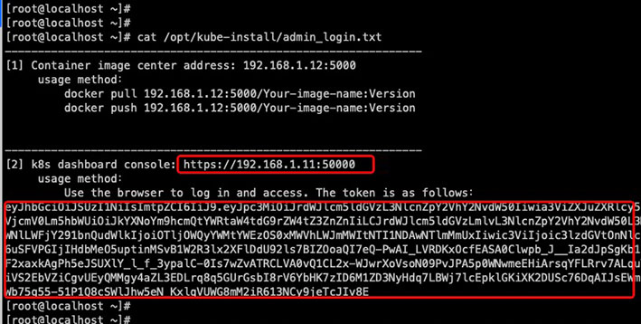

One click rapid deployment of highly available kubernetes cluster, as well as addition of kubernetes node, deletion of kubernetes node, destruction of kubernetes master and repair of kubernetes master in later operation and maintenance stage.
<br>


<br>
<b>[1] Corresponding relation: </b><br>
<br>
Kube-install and kubernetes version correspondence:
<table>
<tr><td>kube-install Version</td><td>Corresponding Relation</td><td>Kubernetes Version</td>
<tr><td>v0.1.* <br>v0.2.* </td><td>  -----> </td><td>v1.14.* </td></tr>
<tr><td>v0.3.* </td><td>  -----> </td><td>v1.14* <br> v1.18.* </td></tr>
</table>
<br>
<br>
<br>
<b>[2] How to install?</b><br>
<br>
2.1 Download kube-install file<br>
Select a k8s-master and execute:<br>

```
# cd /root/
# git clone https://github.com/cloudnativer/kube-install.git 
```

<br>
2.2 Download the kube-install-pkg-0.2.tgz package from this link https://github.com/cloudnativer/kube-install/releases <br>

```
# cd /root/kube-install/
# tar -zxvf kube-install-pkg-0.2.tgz
```

<br>
2.3 Initialization<br>
Perform pre installation initialization<br>

```
# cd /root/kube-install/
# ./kube-install -opt init
```

<br>
2.4 Install k8s cluster<br>
If your server environment is as follows:<br>
<table>
<tr><td>IP Address</td><td>Role</td><td>OS Version</td><td>Root Password</td></tr>
<tr><td>192.168.1.11</td><td>k8s-master,k8s-node</td><td>CentOS Linux release 7</td><td>cloudnativer</td></tr>
<tr><td>192.168.1.12</td><td>k8s-master,k8s-node</td><td>CentOS Linux release 7</td><td>cloudnativer</td></tr>
<tr><td>192.168.1.13</td><td>k8s-master,k8s-node</td><td>CentOS Linux release 7</td><td>cloudnativer</td></tr>
<tr><td>192.168.1.14</td><td>k8s-node</td><td>CentOS Linux release 7</td><td>cloudnativer</td></tr>
<tr><td>192.168.1.15</td><td>k8s-node</td><td>CentOS Linux release 7</td><td>cloudnativer</td></tr>
<tr><td>192.168.1.16</td><td>k8s-node</td><td>CentOS Linux release 7</td><td>cloudnativer</td></tr>
</table>
Well,Execute on the k8s-master selected above:<br>

```
# cd /root/kube-install/
# ./kube-install -opt install -master "192.168.1.11,192.168.1.12,192.168.1.13" -node "192.168.1.11,192.168.1.12,192.168.1.13,192.168.1.14" -mvip "192.168.1.88" -sshpwd "cloudnativer"
```

Note: in the above command, the "-mvip" parameter is the k8s cluster virtual IP address.
<br>
<br>
<br>
2.5 Login k8s dashboard console UI<br>
Execute the following command on the k8s-master you selected to view the k8s dashboard console URL and key:<br>

```
# cat /opt/kube-install/admin_login.txt
```




Log in to the k8s dashboard console UI using the URL and key in the /opt/kube-install/admin_login.txt document.Here are the relevant screenshots:


<br>
<br>
<br>
<b>[3] Operation and maintenance:</b><br>
<br>
After kube-install is installed, you can directly execute "kube-install" command in any directory of any k8s-master server.<br>
<br>
3.1 Delete k8s-node from k8s cluster<br>
Select any k8s-mkaster server, and execute the following command on it:<br>

```
# kube-install -opt delnode -node "192.168.1.13,192.168.1.15" -sshpwd "cloudnativer"
```

<br>
3.2 Add k8s-node to k8s cluster<br>
Select any k8s-mkaster server, and execute the following command on it:<br>

```
# kube-install -opt addnode -node "192.168.1.15,192.168.1.16" -sshpwd "cloudnativer"
```

<br>
3.3 Delete k8s-master from k8s cluster<br>
Select any k8s-mkaster server, and execute the following command on it:<br>

```
# kube-install -opt delmaster -master "192.168.1.13,192.168.1.15" -sshpwd "cloudnativer"
```

<br>
3.4 Rebuild k8s-master to k8s cluster<br>
Select any k8s-mkaster server, and execute the following command on it:<br>

```
# kube-install -opt rebuildmaster -rebuildmaster "192.168.1.13" -sshpwd "cloudnativer"
```

<br>
<br>
<br>
<b>[4] Parameter introduction:</b><br>
<br>
The parameters about kube-install can be viewed using the "kube-install --help" command. <a href="docs/parameters0.2.md">You can also see more detailed parameter introduction here.</a><br>
<br>
<br>
<br>

