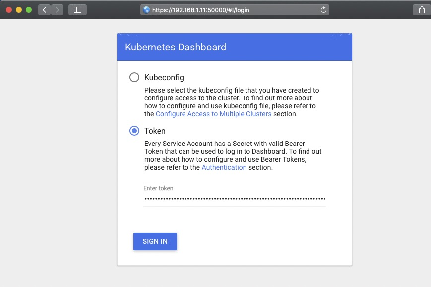
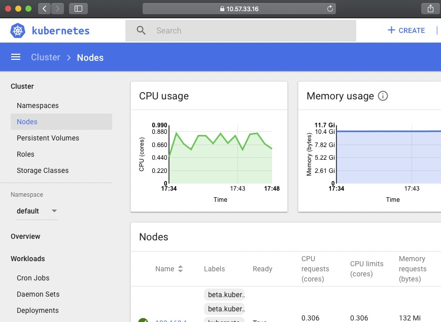

One click fast installation of highly available kubernetes cluster, as well as addition of kubernetes node, deletion of kubernetes node, destruction of kubernetes master and rebuild of kubernetes master in later operation and maintenance stage.
<br>


<br>

# [1] Corresponding relation

<br>
Kube-install and kubernetes version correspondence:
<table>
<tr><td>kube-install Version</td><td>Installation package to download</td><td>Supported installed versions</td>
<tr><td> kube-install v0.1.* </td><td> kube-install-pkg-1.14.tgz</td><td> Install kubernetes v1.14.* </td></tr>
<tr><td> kube-install v0.2.* </td><td> kube-install-pkg-1.14.tgz</td><td> Install kubernetes v1.14.* </td></tr>
<tr><td> kube-install v0.3.* </td><td> kube-install-v1.14.tgz</td><td> Install kubernetes v1.14.* </td></tr>
<tr><td> kube-install v0.3.* </td><td> kube-install-v1.15.tgz</td><td> Install kubernetes v1.15.* </td></tr>
<tr><td> kube-install v0.3.* </td><td> kube-install-v1.16.tgz</td><td> Install kubernetes v1.16.* </td></tr>
<tr><td> kube-install v0.3.* </td><td> kube-install-v1.17.tgz</td><td> Install kubernetes v1.17.* </td></tr>
<tr><td> kube-install v0.3.* </td><td> kube-install-v1.18.tgz</td><td> Install kubernetes v1.18.* </td></tr>
<tr><td> kube-install v0.3.* </td><td> kube-install-v1.19.tgz</td><td> Install kubernetes v1.19.* </td></tr>
</table>
<br>
<br>
<br>

# [2] How to install?

<br>

## 2.1 Download kube-install package file

<br>
You can download the kube-install-*.tgz package from https://github.com/cloudnativer/kube-install/releases. <br>


If you want to install version 1.14 of kubernetes, download the kube-install-v1.14.tgz package file.If you want to install version 1.17 of kubernetes, download the kube-install-v1.17.tgz package file.If you want to install version 1.18 of kubernetes, download the kube-install-v1.18.tgz package file.<br>

For example, we are now installing kubernetes v1.18, and we have downloaded the kube-install-v1.18.tgz package.<br>


```
# cd /root/
# wget https://github.com/cloudnativer/kube-install/releases/download/v0.3.0/kube-install-v1.18.tgz
# tar -zxvf kube-install-v1.18.tgz
# cd /root/kube-install/
```

<br>

## 2.2 Initialize system environment

<br>
Please operate in the root user environment.Perform pre installation initialization:<br>

```
# cd /root/kube-install/
# ./kube-install -opt init
```

<br>

## 2.3 Install kubernetes cluster

<br>
If your server environment is as follows:<br>
<table>
<tr><td>IP Address</td><td>Role</td><td>OS Version</td><td>Root Password</td></tr>
<tr><td>192.168.1.11</td><td>k8s-master,k8s-node</td><td>CentOS Linux release 7</td><td>cloudnativer</td></tr>
<tr><td>192.168.1.12</td><td>k8s-master,k8s-node</td><td>CentOS Linux release 7</td><td>cloudnativer</td></tr>
<tr><td>192.168.1.13</td><td>k8s-master,k8s-node</td><td>CentOS Linux release 7</td><td>cloudnativer</td></tr>
<tr><td>192.168.1.14</td><td>k8s-node</td><td>CentOS Linux release 7</td><td>cloudnativer</td></tr>
</table>
We installed master software on three servers(192.168.1.11,192.168.1.12,192.168.1.13), and node software on on four servers(192.168.1.11,192.168.1.12,192.168.1.13,192.168.1.14).The architecture after installation is shown in the following figure:


Please operate in the root user environment.Well,Execute on the k8s-master selected above:<br>

```
# cd /root/kube-install/
# ./kube-install -opt install -master "192.168.1.11,192.168.1.12,192.168.1.13" -node "192.168.1.11,192.168.1.12,192.168.1.13,192.168.1.14" -mvip "192.168.1.88" -sshpwd "cloudnativer"
```

Note: in the above command, the "-mvip" parameter is the k8s cluster virtual IP address.
<br>
<br>
<br>

## 2.4 Login kubernetes dashboard UI

<br>
Execute the following command on the k8s-master you selected to view the k8s dashboard console URL and key:<br>

```
# cat /opt/kube-install/admin_login.txt
```


Login to the k8s dashboard console UI using the URL and key in the /opt/kube-install/admin_login.txt document.Here are the relevant screenshots:






<br>
<br>
<br>

# [3] Operation and maintenance

<br>
After kube-install is installed, you can directly execute "kube-install" command in any directory of any k8s-master server.<br>
<br>

## 3.1 Add k8s-node to k8s cluster

<br>
Two k8s-nodes (192.168.1.15 and 192.168.1.16) are added to the  cluster in Chapter 2.
<table>
<tr><td>IP Address</td><td>Role</td><td>OS Version</td><td>Root Password</td></tr>
<tr><td>192.168.1.11</td><td>k8s-master,k8s-node</td><td>CentOS Linux release 7</td><td>cloudnativer</td></tr>
<tr><td>192.168.1.12</td><td>k8s-master,k8s-node</td><td>CentOS Linux release 7</td><td>cloudnativer</td></tr>
<tr><td>192.168.1.13</td><td>k8s-master,k8s-node</td><td>CentOS Linux release 7</td><td>cloudnativer</td></tr>
<tr><td>192.168.1.14</td><td>k8s-node</td><td>CentOS Linux release 7</td><td>cloudnativer</td></tr>
<tr><td>192.168.1.15</td><td>k8s-node</td><td>CentOS Linux release 7</td><td>cloudnativer</td></tr>
<tr><td>192.168.1.16</td><td>k8s-node</td><td>CentOS Linux release 7</td><td>cloudnativer</td></tr>
</table>
The architecture after installation is shown in the following figure:


Select any k8s-mkaster server, and execute the following command on it:<br>

```
# kube-install -opt addnode -node "192.168.1.15,192.168.1.16" -sshpwd "cloudnativer"
```

<br>

## 3.2 Delete k8s-node from k8s cluster

<br>
Select any k8s-mkaster server, and execute the following command on it:<br>

```
# kube-install -opt delnode -node "192.168.1.13,192.168.1.15" -sshpwd "cloudnativer"
```

<br>

## 3.3 Delete k8s-master from k8s cluster

<br>
Select any k8s-mkaster server, and execute the following command on it:<br>

```
# kube-install -opt delmaster -master "192.168.1.13,192.168.1.15" -sshpwd "cloudnativer"
```

<br>

## 3.4 Rebuild k8s-master to k8s cluster

<br>
Select any k8s-mkaster server, and execute the following command on it:<br>

```
# kube-install -opt rebuildmaster -rebuildmaster "192.168.1.13" -sshpwd "cloudnativer"
```

<br>
<br>
<br>

# [4] Parameter introduction

<br>
The parameters about kube-install can be viewed using the "kube-install help" command. <a href="docs/parameters0.3.md">You can also see more detailed parameter introduction here.</a><br>
<br>
<br>
<br>

