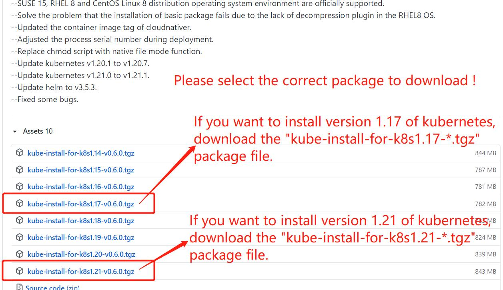

One click fast installation of highly available kubernetes cluster, as well as addition of kubernetes node, deletion of kubernetes node, destruction of kubernetes master and rebuild of kubernetes master in later operation and maintenance stage.
<br>


<br>
<font size="5">[1] Corresponding relation: </font><br>
<br>
Kube-install and kubernetes version correspondence:
<table>
<tr><td>kube-install Version</td><td>Install the base package to download</td><td>Supported installed versions</td>
<tr><td> kube-install v0.1.* </td><td> kube-install-pkg-1.14.tgz</td><td> Install kubernetes v1.14.* </td></tr>
<tr><td> kube-install v0.2.* </td><td> kube-install-pkg-1.14.tgz</td><td> Install kubernetes v1.14.* </td></tr>
<tr><td> kube-install v0.3.* </td><td> kube-install-pkg-1.14.tgz</td><td> Install kubernetes v1.14.* </td></tr>
<tr><td> kube-install v0.3.* </td><td> kube-install-pkg-1.18.tgz</td><td> Install kubernetes v1.18.* </td></tr>
<tr><td> kube-install v0.3.* </td><td> kube-install-pkg-1.19.tgz</td><td> Install kubernetes v1.19.* </td></tr>
</table>
<br>
<br>
<br>
<font size="5">[2] How to install?</font><br>
<br>
<b>2.1 Download kube-install bin file</b><br>
Select a k8s-master and execute:<br>

```
# cd /root/
# git clone https://github.com/cloudnativer/kube-install.git 
# ls /root/kube-install/
```

<br>
<b>2.2 Download the kube-install-pkg-*.tgz base package</b><br>
You can download the kube-install-pkg-x.x.tgz package from https://github.com/cloudnativer/kube-install/releases. <br>



If you want to install version 1.14 of kubernetes, download the kube-install-pkg-1.14.tgz package file.If you want to install version 1.18 of kubernetes, download the kube-install-pkg-1.18.tgz package file.<br>

For example, we are now installing kubernetes v1.18, and we have downloaded the kube-install-pkg-1.18.tgz package.<br>


```
# wget https://github.com/cloudnativer/kube-install/releases/download/v0.3.0/kube-install-pkg-1.18.tgz
# tar -zxvf kube-install-pkg-1.18.tgz -C /root/kube-install/
# ls /root/kube-install/pkg/
```

<br>
<b>2.3 Initialize system environment</b><br>
Perform pre installation initialization<br>

```
# cd /root/kube-install/
# ./kube-install -opt init
```

<br>
<b>2.4 Install kubernetes cluster</b><br>
If your server environment is as follows:<br>
<table>
<tr><td>IP Address</td><td>Role</td><td>OS Version</td><td>Root Password</td></tr>
<tr><td>192.168.1.11</td><td>k8s-master,k8s-node</td><td>CentOS Linux release 7</td><td>cloudnativer</td></tr>
<tr><td>192.168.1.12</td><td>k8s-master,k8s-node</td><td>CentOS Linux release 7</td><td>cloudnativer</td></tr>
<tr><td>192.168.1.13</td><td>k8s-master,k8s-node</td><td>CentOS Linux release 7</td><td>cloudnativer</td></tr>
<tr><td>192.168.1.14</td><td>k8s-node</td><td>CentOS Linux release 7</td><td>cloudnativer</td></tr>
<tr><td>192.168.1.15</td><td>k8s-node</td><td>CentOS Linux release 7</td><td>cloudnativer</td></tr>
<tr><td>192.168.1.16</td><td>k8s-node</td><td>CentOS Linux release 7</td><td>cloudnativer</td></tr>
</table>
Well,Execute on the k8s-master selected above:<br>

```
# cd /root/kube-install/
# ./kube-install -opt install -master "192.168.1.11,192.168.1.12,192.168.1.13" -node "192.168.1.11,192.168.1.12,192.168.1.13,192.168.1.14" -mvip "192.168.1.88" -sshpwd "cloudnativer"
```

Note: in the above command, the "-mvip" parameter is the k8s cluster virtual IP address.
<br>
<br>
<br>
<b>2.5 Login kubernetes dashboard UI</b><br>
Execute the following command on the k8s-master you selected to view the k8s dashboard console URL and key:<br>

```
# cat /opt/kube-install/admin_login.txt
```


Log in to the k8s dashboard console UI using the URL and key in the /opt/kube-install/admin_login.txt document.Here are the relevant screenshots:


<br>
<br>
<br>
<font size="5">[3] Operation and maintenance:</font><br>
<br>
After kube-install is installed, you can directly execute "kube-install" command in any directory of any k8s-master server.<br>
<br>
<b>3.1 Delete k8s-node from k8s cluster</b><br>
Select any k8s-mkaster server, and execute the following command on it:<br>

```
# kube-install -opt delnode -node "192.168.1.13,192.168.1.15" -sshpwd "cloudnativer"
```

<br>
<b>3.2 Add k8s-node to k8s cluster</b><br>
Select any k8s-mkaster server, and execute the following command on it:<br>

```
# kube-install -opt addnode -node "192.168.1.15,192.168.1.16" -sshpwd "cloudnativer"
```

<br>
<b>3.3 Delete k8s-master from k8s cluster</b><br>
Select any k8s-mkaster server, and execute the following command on it:<br>

```
# kube-install -opt delmaster -master "192.168.1.13,192.168.1.15" -sshpwd "cloudnativer"
```

<br>
<b>3.4 Rebuild k8s-master to k8s cluster</b><br>
Select any k8s-mkaster server, and execute the following command on it:<br>

```
# kube-install -opt rebuildmaster -rebuildmaster "192.168.1.13" -sshpwd "cloudnativer"
```

<br>
<br>
<br>
<font size="5">[4] Parameter introduction:</font><br>
<br>
The parameters about kube-install can be viewed using the "kube-install help" command. <a href="docs/parameters0.3.md">You can also see more detailed parameter introduction here.</a><br>
<br>
<br>
<br>

