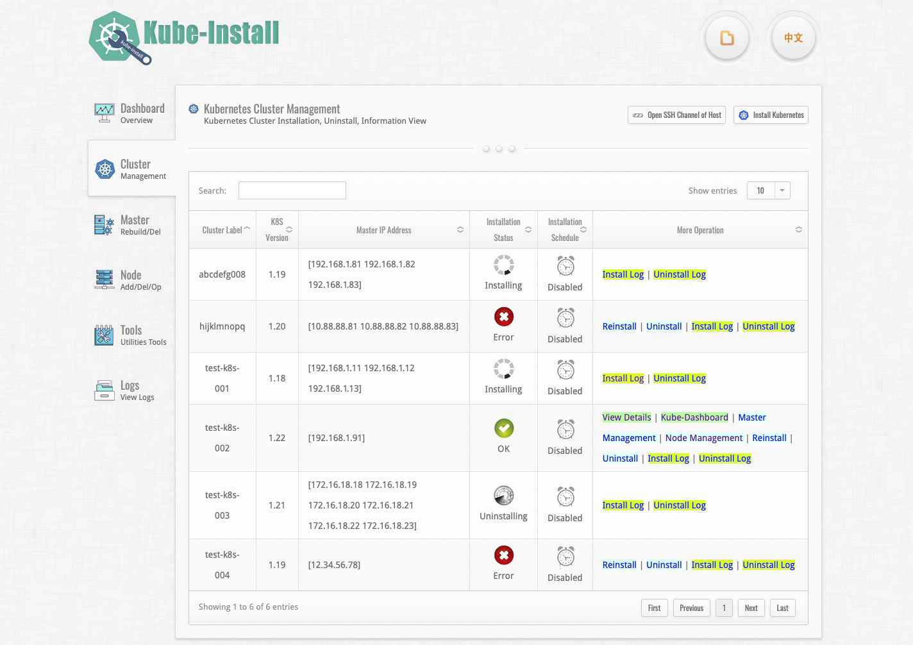

二进制方式一键离线安装高可用的多kubernetes集群，支持定时安装、添加kubernetes节点、删除kubernetes节点、销毁kubernetes主机、重建kubernetes主机、卸载集群等。
<br>
(不需要在目标主机上安装任何软件，只需要有纯净的裸机即可离线完成高可用kubernetes集群的部署！)
<br>


<br>

切换语言： <a href="README0.8.md">English Documents</a> | <a href="README0.8-zh-hk.md">繁体中文文档</a> | <a href="README0.8-zh.md">简体中文文档</a> | <a href="README0.8-jp.md">日本語の文書</a>

<br>

# [1] 兼容性

<br>
兼容性说明:

<table>
<tr><td><b>kube-install版本</b></td><td><b>支持的Kubernetes版本</b></td><td><b>支持的操作系统</b></td><td><b>说明文档</b></td></tr>
<tr><td> kube-install v0.8.* </td><td> kubernetes v1.24, v1.23, v1.22, v1.20, v1.19, v1.18 </td><td> CentOS 7 , RHEL 7 , CentOS 8 , RHEL 8 , SUSE Linux 15 , Ubuntu 20 </td><td><a href="README0.8-zh.md">查看详情</a></td></tr>
<tr><td> kube-install v0.7.* </td><td> kubernetes v1.23, v1.22, v1.20, v1.19, v1.18, v1.17 </td><td> CentOS 7 , RHEL 7 , CentOS 8 , RHEL 8 , SUSE Linux 15 , Ubuntu 20 </td><td><a href="README0.7-zh.md">查看详情</a></td></tr>
<tr><td> kube-install v0.6.* </td><td> kubernetes v1.22, v1.21, v1.20, v1.19, v1.18, v1.17, v1.16, v1.15, v1.14 </td><td> CentOS 7 , RHEL 7 , CentOS 8 , RHEL 8 , SUSE Linux 15 </td><td><a href="README0.6.md">查看详情</a></td></tr>
<tr><td> kube-install v0.5.* </td><td> kubernetes v1.21, v1.20, v1.19, v1.18, v1.17, v1.16, v1.15, v1.14 </td><td> CentOS 7 , RHEL 7 </td><td><a href="README0.5.md">查看详情</a></td></tr>
<tr><td> kube-install v0.4.* </td><td> kubernetes v1.21, v1.20, v1.19, v1.18, v1.17, v1.16, v1.15, v1.14 </td><td> CentOS 7 , RHEL 7 </td><td><a href="README0.4.md">查看详情</a></td></tr>
<tr><td> kube-install v0.3.* </td><td> kubernetes v1.18, v1.17, v1.16, v1.15, v1.14 </td><td>CentOS 7</td><td><a href="README0.3.md">查看详情</a></td></tr>
<tr><td> kube-install v0.2.* </td><td> kubernetes v1.14 </td><td> CentOS 7 </td><td><a href="README0.2.md">查看详情</a></td></tr>
<tr><td> kube-install v0.1.* </td><td> kubernetes v1.14 </td><td> CentOS 7 </td><td><a href="README0.1.md">查看详情</a></td></tr>
</table>


<br>
注意：kube-install支持CentOS 7、CentOS 8、SUSE 15、RHEL 7和RHEL 8操作系统环境，<a href="docs/os-support.md">点击这里查看kube-install所支持的操作系统发行版的列表</a>。
<br>
<br>
<br>

# [2] 获取kube-install软件包

<br>

你可以从 https://github.com/cloudnativer/kube-install/releases 这里下载`kube-install-*.tgz`软件包。 <br>
举例，下载`kube-install-allinone-v0.8.0.tgz`软件包进行安装：<br>

```
# cd /root/
# curl -O https://github.com/cloudnativer/kube-install/releases/download/v0.8.0/kube-install-allinone-v0.8.0.tgz
# tar -zxvf kube-install-allinone-v0.8.0.tgz
# cd /root/kube-install/
```

注意：如果你本地的网络环境不是太好的话，建议你使用支持断点续传的下载软件进行软件包下载，这样可以获得更好的下载体验。

<br>
<br>
<br>

# [3] 通过Web平台安装kubernetes集群

<br>
如果你有四台服务器，k8s-master安装在三台服务器（192.168.1.11、192.168.1.12、192.168.1.13）上，k8s-node安装在四台服务器（192.168.1.11、192.168.1.12、192.168.1.13、192.168.1.14）上。服务器的操作系统是纯净的CentOS Linux或RHEL（RedHat Enterprise Linux），具体如下表所示：
<table>
<tr><td><b>IP地址</b></td><td><b>需要安装的组件</b></td><td><b>操作系统版本</b></td><td><b>root密码</b></td></tr>
<tr><td>192.168.1.11</td><td>k8s-master,k8s-node,kube-install</td><td>CentOS Linux release 7 or Red Hat Enterprise Linux(RHEL) 7</td><td>cloudnativer</td></tr>
<tr><td>192.168.1.12</td><td>k8s-master,k8s-node</td><td>CentOS Linux release 7 or Red Hat Enterprise Linux(RHEL) 7</td><td>cloudnativer</td></tr>
<tr><td>192.168.1.13</td><td>k8s-master,k8s-node</td><td>CentOS Linux release 7 or Red Hat Enterprise Linux(RHEL) 7</td><td>cloudnativer</td></tr>
<tr><td>192.168.1.14</td><td>k8s-node</td><td>CentOS Linux release 7 or Red Hat Enterprise Linux(RHEL) 7</td><td>cloudnativer</td></tr>
</table>
安装后的部署架构如下图所示：


<br>
注意：这里使用192.168.1.11作为kube-install源安装机。事实上，您可以将任何主机(包括kubernetes集群之外的任何主机)用来作为kube-install源安装机！
<br>

## 3.1 初始化系统环境

<br>
首先你需要使用root用户对kube-install源安装机本地环境进行初始化操作，进入解压后的软件目录执行`kube-install -init`命令：<br>

```
# cd /root/kube-install/
# ./kube-install -init -ostype "centos7"
```

注意：kube-install软件支持`rhel7`, `rhel8`, `centos7`, `centos8`, `ubuntu20`, `suse15`等版本的操作系统，在做初始化操作的时候，请确保`-ostype`参数设置正确。
<br>

<br>

## 3.2 运行kube-install的Web管理服务

然后，执行`systemctl start kube-install`命令来运行kube-install的Web管理平台服务。kube-install的Web管理平台具备SSH打通、定时安装部署、Node扩容、Master修复、集群卸载等强大的功能，你可以在Web管理平台上获得更好的安装体验。

```
# systemctl start kube-install.service
#
# systemctl status kube-install.service
  ● kube-install.service - kube-install One click fast installation of highly available kubernetes cluster.
     Loaded: loaded (/etc/systemd/system/kube-install.service; disabled; vendor preset: disabled)
     Active: active (running) since Fri 2021-08-20 14:30:55 CST; 21min ago
       Docs: https://cloudnativer.github.io/
   Main PID: 2768 (kube-install)
     CGroup: /system.slice/kube-install.service
             └─2768 /go/src/kube-install/kube-install -daemon
   ...

```

此时，你就可以使用网页浏览器打开`http://kube-install源安装机IP:9080`，访问kube-install的Web管理平台了。使用用户名 `admin` 和默认密码 `CloudNativeR` 登录！（你可以后期通过web平台修改密码）
<br>

注意：kube-install的Web管理平台服务默认监听`TCP 9080`。如果你想修改这个监听地址的话，可以通过修改`/etc/systemd/system/kube-install.service`文件中的`kube-install -daemon -listen ip:port`参数来进行设置，<a href="docs/systemd0.7.md">点击这里可以查看详细文档</a>！<br>

## 3.3 快速安装部署kubernetes集群

然后，点击Web界面右上角的的`Install Kubernetes`按钮开始kubernetes集群的安装。


注意：在你开始给目标主机安装kubernetes集群之前，请先打通kube-install源安装机本地到目标主机的SSH免密通道。
你可以自己手工打通到目标主机的SSH通道，也可以点击右上角的`Open SSH Channel of Host`按钮来进行打通，<a href="docs/webssh0.8.md">点击这里可以查看更加详细的文档</a>。
<br>

在弹出的安装表单窗口中填写好安装所需的参数信息：


说明：

* 请选择好你需要安装的Kubernetes版本，目前kube-install支持v1.17~1.24版本的Kubernetes安装部署，其他版本的Kubernete暂未进行验证。
* 请选择好你需要安装的CNI插件，目前kube-install支持`Flannel`、`Calico`、`Kube-router`、`Weave`、`Cilium`等CNI插件类型。如果需要安装`Cilium`，请将Linux内核升级到4.9或以上版本。
* 请选择好你的操作系统环境。由于低版本的`Centos 7`和`RHEL 7`可能缺少内核模块，kube-install对`Centos 7`和`RHEL 7`操作系统内核的提供了自动升级到4.19的功能，你可以选择使用此功能，也可能自己手工优化操作系统内核。

<br>

注意：如果不设置定时安装的话，默认为立即开始安装。你如果想进行定时安装，也可以在下方的选择定时安装的日期与时间。



你可以<a href="docs/webinstall0.7-zh.md">点击这里可以查看更多通过kube-install的Web管理平台安装部署的详细信息</a>。
<br>
<br>
<br>

# [4] 通过命令行快速安装kubernetes集群

<br>
除了可以使用Web平台安装kubernetes集群外，你还可以通过kube-install的命令行来安装kubernetes集群，kube-install的命令行使用起来比较简单方便。
<br>

## 4.1 初始化系统环境

<br>
首先你需要使用root用户对kube-install源安装机本地环境进行初始化操作，进入解压后的软件目录执行`kube-install -init`命令：<br>

```
# cd /root/kube-install/
# ./kube-install -init -ostype "centos7"
```

注意：kube-install软件支持`rhel7`, `rhel8`, `centos7`, `centos8`, `ubuntu20`, `suse15`等版本的操作系统，在做初始化操作的时候，请确保`-ostype`参数设置正确。<br>

<br>

## 4.2 打通到目标主机的SSH通道

<br>
在你开始给目标主机安装kubernetes集群之前，请先打通kube-install源安装机本地到目标主机的SSH免密通道。
你可以自己手工打通到目标主机的SSH通道，也可以通过`kube-install -exec sshcontrol`命令来打通：<br>

```
# cd /root/kube-install/
# ./kube-install -exec sshcontrol -sship "192.168.1.11,192.168.1.12,192.168.1.13,192.168.1.14" -sshpass "cloudnativer"
```

你也可以通过kube-install的Web管理平台来打通到目标主机的SSH通道，<a href="docs/webssh0.8.md">点击这里查看使用Web管理平台打通SSH通道的方法</a>！<br>

<br>

## 4.3 一键安装部署kubernetes集群

<br>
在kube-install源安装机上使用root用户执行下面这条命令即可：

```
# cd /root/kube-install/
# ./kube-install -exec install -master "192.168.1.11,192.168.1.12,192.168.1.13" -node "192.168.1.11,192.168.1.12,192.168.1.13,192.168.1.14" -k8sver "1.22" -ostype "centos7" -label "192168001011"
```

注意：

* kube-install软件支持`rhel7`, `rhel8`, `centos7`, `centos8`, `ubuntu20`, `suse15`等版本的操作系统，在做安装部署操作的时候，请确保`-ostype`参数设置正确。由于低版本的centos7和redhat7可能缺少内核模块，`kube-install`对centos7和rhel7操作系统内核的提供了自动升级到4.19的功能，你可以选择`-upgradekernel`参数使用此功能，也可能自己手工优化操作系统内核。
* 请选择好你需要安装的CNI插件，目前`kube-install`支持Flannel、Calico、Kube-router、Weave、Cilium等CNI插件类型。如果需要安装“Cilium”，请将Linux内核升级到4.9或以上版本。

<br>

另外，如果你需要自定义制定Kubernetes集群安装在目标主机上的目录路径的话，可以带上`-softdir`参数来设置。

<br>


## 4.4 登录kubernetes dashboard界面

<br>
通过查看loginkey.txt文件可以获取kube-dashboard的登录地址和密钥。<br>

```
# cat /opt/kube-install/loginkey.txt
```


如下面的截图所示为kube-dashboard的登录地址和密钥：


<br>

<br>

# [5] 扩容与销毁Node|修复Master|卸载集群

<br>

Kube-install不仅可以很方便的安装单机和高可用的kubernetes集群，还可以支持k8s-node的扩容与销毁、k8s-master的销毁与修复、kubernetes集群的卸载等。<br>

举例，现在需要给第[2]章节中安装好的kubernetets集群，增加2个k8s-node节点(192.168.1.15 and 192.168.1.16)，相关信息如下：

<table>
<tr><td><b>IP地址</b></td><td><b>需要安装的组件</b></td><td><b>操作系统版本</b></td><td><b>root密码</b></td></tr>
<tr><td>192.168.1.11</td><td>k8s-master,k8s-node,kube-install</td><td>CentOS Linux release 7 or Red Hat Enterprise Linux(RHEL) 7</td><td>cloudnativer</td></tr>
<tr><td>192.168.1.12</td><td>k8s-master,k8s-node</td><td>CentOS Linux release 7 or Red Hat Enterprise Linux(RHEL) 7</td><td>cloudnativer</td></tr>
<tr><td>192.168.1.13</td><td>k8s-master,k8s-node</td><td>CentOS Linux release 7 or Red Hat Enterprise Linux(RHEL) 7</td><td>cloudnativer</td></tr>
<tr><td>192.168.1.14</td><td>k8s-node</td><td>CentOS Linux release 7 or Red Hat Enterprise Linux(RHEL) 7</td><td>cloudnativer</td></tr>
<tr><td><b>192.168.1.15</b></td><td>k8s-node</td><td>CentOS Linux release 7 or Red Hat Enterprise Linux(RHEL) 7</td><td>cloudnativer</td></tr>
<tr><td><b>192.168.1.16</b></td><td>k8s-node</td><td>CentOS Linux release 7 or Red Hat Enterprise Linux(RHEL) 7</td><td>cloudnativer</td></tr>
</table>

在kube-install源主机上使用root用户执行如下命令：<br>

```
# kube-install -exec addnode -node "192.168.1.15,192.168.1.16" -k8sver "1.22" -ostype "centos7" -label "192168001011"
```

注意：kube-install软件支持`rhel7`, `rhel8`, `centos7`, `centos8`, `ubuntu20`, `suse15`等版本的操作系统，在做安装部署操作的时候，请确保`-ostype`参数设置正确。<br>
另外，如果你需要自定义制定Kubernetes集群安装在目标主机上的目录路径的话，可以带上`-softdir`参数来设置。

<br>

安装完毕之后的部署架构如下图所示：


除了使用`kube-install -exec addnode`命令进行k8s-node节点扩容外，你也同样可以使用kube-install的Web管理平台来对k8s-node节点进行扩容，点击“Add Node”按钮填写表单即可完成k8s-node的扩容。<a href="docs/webinstall0.7-zh.md">点击这里可以查看使用kube-install的Web管理平台来扩容k8s-node节点的方法</a>。


你可以点击“Enable Terminal”和“Web Terminal”来使用web终端管理k8s-node服务器。<br>

注意：你可以<a href="docs/operation0.7-zh.md">点击这里查看更多关于销毁k8s-node和k8s-master、修复k8s-master、卸载集群的操作</a>。

<br>
<br>


# [6] kube-install命令行帮助

<br>

你可以执行`kube-install -help`命令查看kube-install的使用帮助文档，<a href="docs/parameters0.8.md">你也可以点击这里查看更加详细的命令行帮助文档</a>。

<br>
<br>

# [7] kube-install集群架构

<br>

`./data/`目录是用来存储`kube-install`安装部署的所有状态信息的，包括所有kubernetes集群的配置等信息。你可以将`./data/`目录通过文件存储的形式共享起来，再借助于一些负载均衡软件实现主备切换或负载均衡集群效果。你可以<a href="docs/architecture0.8.m
d">点击这里查看更加详细的架构文档</a>。


<br>
<br>


# [8] 欢迎提交Issues和PR

如果你在使用过程中遇到问题，可以点击<a href="https://github.com/cloudnativer/kube-install/issues">https://github.com/cloudnativer/kube-install/issues</a>向我们提交Issues，也可以Fork源代码，然后尝试修复BUG之后，向我们提交PR。<br>
<br>

```
# git clone your-fork-code
# git checkout -b your-new-branch
# git commit -am "Fix bug or add some feature"
# git push origin your-new-branch
```
<br>
欢迎给我们提交Issues和PR。
<br>
谢谢每一位贡献者！

<br>
<br>
<br>


