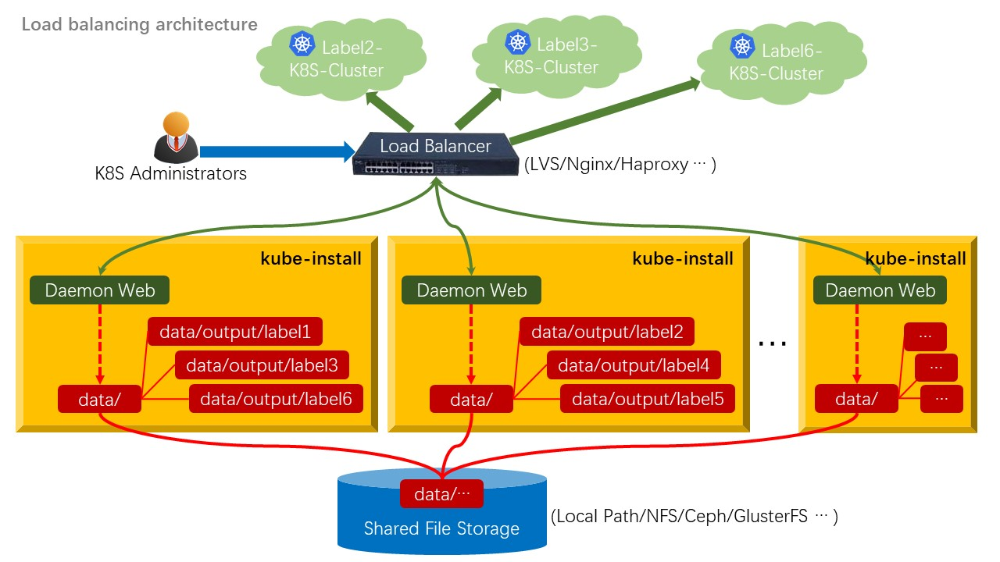

# kube-install cluster architecture description

 

The `./data/` directory is used to store all status information of `kube-install`, including configuration information of all kubernetes clusters. You can share the `./data/` directory through file storage, so as to realize active and standby or load balancing cluster.

 

## Active/standby architecture

 

You can use software such as `Keepalived` or `Heartbeat` to detect and switch between `active and standby`.

 
 

## Load balancing architecture

 

You can use `LVS`, `Nginx` or `Haproxy` software to achieve `load balancing` and cluster switching.

 
 
 
