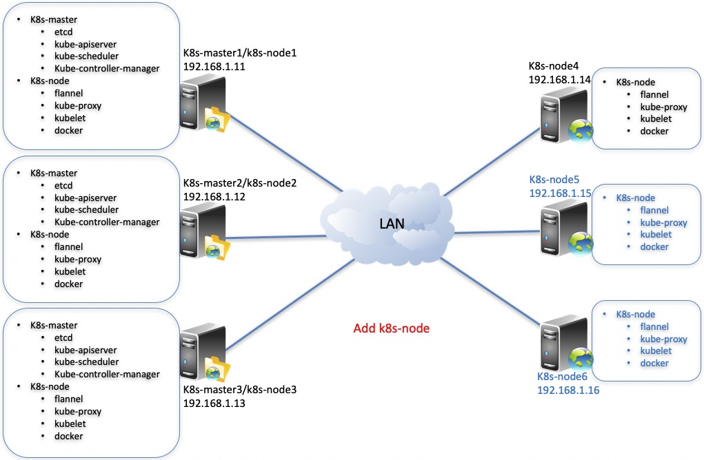

# Operation and maintenance

<br>

If you have four servers, kubernetes master software is installed on the three servers (192.168.1.11,192.168.1.12,192.168.1.13), and kubernetes node software is installed on the three servers (192.168.1.11,192.168.1.12,192.168.1.13,192.168.1.14). <br>
<table>
<tr><td>IP Address</td><td>Role</td><td>OS Version</td><td>Root Password</td></tr>
<tr><td>192.168.1.11</td><td>k8s-master,k8s-node</td><td>CentOS Linux release 7</td><td>cloudnativer</td></tr>
<tr><td>192.168.1.12</td><td>k8s-master,k8s-node</td><td>CentOS Linux release 7</td><td>cloudnativer</td></tr>
<tr><td>192.168.1.13</td><td>k8s-master,k8s-node</td><td>CentOS Linux release 7</td><td>cloudnativer</td></tr>
<tr><td>192.168.1.14</td><td>k8s-node</td><td>CentOS Linux release 7</td><td>cloudnativer</td></tr>
</table>

The current kubernetes cluster architecture is as follows:


<br>


## 1 Add k8s-node to k8s cluster

<br>
You will install two servers (192.168.1.15 and 192.168.1.16) as k8s-node and join the kubernetets cluster in Chapter 2.
<table>
<tr><td>IP Address</td><td>Role</td><td>OS Version</td><td>Root Password</td></tr>
<tr><td>192.168.1.11</td><td>k8s-master,k8s-node</td><td>CentOS Linux release 7</td><td>cloudnativer</td></tr>
<tr><td>192.168.1.12</td><td>k8s-master,k8s-node</td><td>CentOS Linux release 7</td><td>cloudnativer</td></tr>
<tr><td>192.168.1.13</td><td>k8s-master,k8s-node</td><td>CentOS Linux release 7</td><td>cloudnativer</td></tr>
<tr><td>192.168.1.14</td><td>k8s-node</td><td>CentOS Linux release 7</td><td>cloudnativer</td></tr>
<tr><td><b>192.168.1.15</b></td><td>k8s-node</td><td>CentOS Linux release 7</td><td>cloudnativer</td></tr>
<tr><td><b>192.168.1.16</b></td><td>k8s-node</td><td>CentOS Linux release 7</td><td>cloudnativer</td></tr>
</table>

Select any k8s-mkaster server, and execute the following command on it:<br>

```
# kube-install -opt addnode -node "192.168.1.15,192.168.1.16" -sshpwd "cloudnativer"
```

The architecture after installation is shown in the following figure:



<br>

## 2 Delete k8s-node from k8s cluster

<br>
You will delete the two k8s-nodes (192.168.1.15 and 192.168.1.16) from the kubernetets cluster.
Select any k8s-mkaster server, and execute the following command on it:<br>

```
# kube-install -opt delnode -node "192.168.1.13,192.168.1.15" -sshpwd "cloudnativer"
```

The architecture after installation is shown in the following figure:


<br>

## 3 Delete k8s-master from k8s cluster

<br>
You will Delete the k8s-master (192.168.1.13) from the kubernetets cluster.
Select any k8s-mkaster server, and execute the following command on it:<br>

```
# kube-install -opt delmaster -master "192.168.1.13" -sshpwd "cloudnativer"
```

The architecture after installation is shown in the following figure:


<br>

## 4 Rebuild k8s-master to k8s cluster

<br>
You will rebuild the damaged k8s-master (192.168.1.13) in the kubernetets cluster.
Select any k8s-mkaster server, and execute the following command on it:<br>

```
# kube-install -opt rebuildmaster -rebuildmaster "192.168.1.13" -sshpwd "cloudnativer"
```

The architecture after installation is shown in the following figure:


<br>
<br>
<br>
