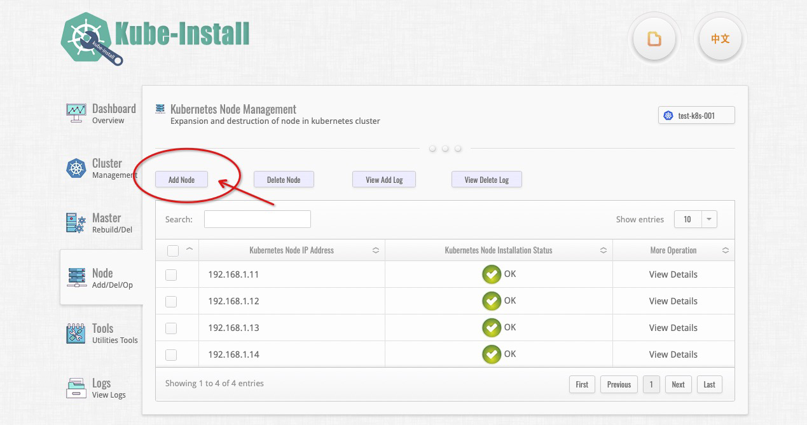
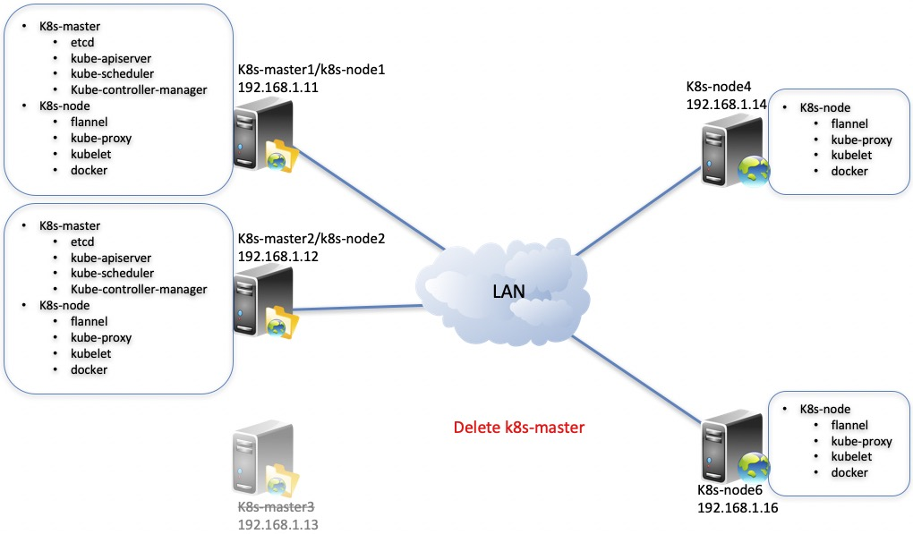

# 扩容与销毁Node、修复与销毁Master、卸载集群

<br>

如果你有四台服务器，k8s-master安装在三台服务器（192.168.1.11、192.168.1.12、192.168.1.13）上，k8s-node安装在四台服务器（192.168.1.11、192.168.1.12、192.168.1.13、192.168.1.14）上。服务器的操作系统是纯净的CentOS Linux或RHEL（RedHat Enterprise Linux），具体如下表所示：
<table>
<tr><td><b>IP地址</b></td><td><b>已经安装的组件</b></td><td><b>操作系统版本</b></td><td><b>root密码</b></td></tr>
<tr><td>192.168.1.11</td><td>k8s-master,k8s-node,kube-install</td><td>CentOS Linux release 7 or Red Hat Enterprise Linux(RHEL) 7</td><td>cloudnativer</td></tr>
<tr><td>192.168.1.12</td><td>k8s-master,k8s-node</td><td>CentOS Linux release 7 or Red Hat Enterprise Linux(RHEL) 7</td><td>cloudnativer</td></tr>
<tr><td>192.168.1.13</td><td>k8s-master,k8s-node</td><td>CentOS Linux release 7 or Red Hat Enterprise Linux(RHEL) 7</td><td>cloudnativer</td></tr>
<tr><td>192.168.1.14</td><td>k8s-node</td><td>CentOS Linux release 7 or Red Hat Enterprise Linux(RHEL) 7</td><td>cloudnativer</td></tr>
</table>

Kubernetes集群的部署架构如下图所示：


<br>

接下来，我们将使用kube-install来对上面的Kubernetes集群进行扩容与销毁Node、修复与销毁Master、卸载集群等日常的运维管理操作。

<br>

## 给Kubernetes集群扩容Node

<br>
给kubernetets集群增加2个k8s-node节点(192.168.1.15 and 192.168.1.16)，相关信息如下：

<table>
<tr><td><b>IP地址</b></td><td><b>需要安装的组件</b></td><td><b>操作系统版本</b></td><td><b>root密码</b></td></tr>
<tr><td>192.168.1.11</td><td>k8s-master,k8s-node,kube-install</td><td>CentOS Linux release 7 or Red Hat Enterprise Linux(RHEL) 7</td><td>cloudnativer</td></tr>
<tr><td>192.168.1.12</td><td>k8s-master,k8s-node</td><td>CentOS Linux release 7 or Red Hat Enterprise Linux(RHEL) 7</td><td>cloudnativer</td></tr>
<tr><td>192.168.1.13</td><td>k8s-master,k8s-node</td><td>CentOS Linux release 7 or Red Hat Enterprise Linux(RHEL) 7</td><td>cloudnativer</td></tr>
<tr><td>192.168.1.14</td><td>k8s-node</td><td>CentOS Linux release 7 or Red Hat Enterprise Linux(RHEL) 7</td><td>cloudnativer</td></tr>
<tr><td><b>192.168.1.15</b></td><td>k8s-node</td><td>CentOS Linux release 7 or Red Hat Enterprise Linux(RHEL) 7</td><td>cloudnativer</td></tr>
<tr><td><b>192.168.1.16</b></td><td>k8s-node</td><td>CentOS Linux release 7 or Red Hat Enterprise Linux(RHEL) 7</td><td>cloudnativer</td></tr>
</table>

在kube-install源主机上使用root用户执行如下命令：<br>

```
# kube-install -exec addnode -node "192.168.1.15,192.168.1.16" -k8sver "1.22" -ostype "centos7" -label "192168001011"
```

注意：kube-install软件支持`rhel7`, `rhel8`, `centos7`, `centos8`, `ubuntu20`, `suse15`等版本的操作系统，在做安装部署操作的时候，请确保`-ostype`参数设置正确。<br>
另外，如果你需要自定义制定Kubernetes集群安装在目标主机上的目录路径的话，可以带上`-softdir`参数来设置。



除了使用`kube-install -exec addnode`命令进行k8s-node节点扩容外，你也同样可以使用kube-install的Web管理平台来对k8s-node节点进行扩容。<a href="docs/webinstall0.7-zh.md">点击这里可以查看使用kube-install的Web管理平台来扩容k8s-node节点的方法</a>。

<br>

扩容完毕之后的部署架构如下图所示：


<br>

## 销毁Kubernetes集群中的Node

<br>

执行下面的命令，将会把Kubernetes集群中的两个k8s-node节点销毁掉(包括这两个主机上的kubelet、kube-proxy、docker等k8s-node相关软件)：<br>

```
# kube-install -exec delnode -node "192.168.1.13,192.168.1.15" -label "192168001011"
```

注意：如果你在安装Kubernetes集群或扩容k8s-node的时候带上了`-softdir`参数来自定义安装目录路径的话，在销毁Kubernetes集群Node的时候也应该带上`-softdir`参数来指定安装目录路径，否则可能导致销毁不彻底。<br>


除了使用`kube-install -exec delnode`命令对k8s-node节点进行销毁外，你也同样可以使用kube-install的Web管理平台来对k8s-node节点进行销毁操作。<a href="docs/webinstall0.7-zh.md">点击这里可以查看kube-install的Web管理平台的使用方法</a>。

<br>

销毁完毕之后的部署架构如下图所示：


<br>

## 销毁Kubernetes集群中的Master

<br>
执行下面的命令，将会把Kubernetes集群中的这个k8s-master节点销毁掉(包括这主机上的kube-apiserver、kube-controller-manager、kube-scheduler、etcd等k8s-master相关软件)：<br>

```
# kube-install -exec delmaster -master "192.168.1.13" -label "192168001011"
```

注意：如果你在安装Kubernetes集群的时候带上了`-softdir`参数来自定义安装目录路径的话，在销毁Kubernetes集群Master的时候也应该带上`-softdir`参数来指定安装目录路径，否则可能导致销毁不彻底。<br>
除了使用`kube-install -exec delmaster`命令对k8s-master节点进行销毁外，你也同样可以使用kube-install的Web管理平台来对k8s-master节点进行销毁操作。<a href="docs/webinstall0.7-zh.md">点击这里可以查看kube-install的Web管理平台的使用方法</a>。

销毁完毕之后的部署架构如下图所示：



<br>

## 修复Kubernetes集群中的Master

<br>
执行下面的命令，将会修复Kubernetes集群中的这个k8s-master节点(包括自动部署kube-apiserver、kube-controller-manager、kube-scheduler、etcd等k8s-master相关软件)：<br>

```
# kube-install -exec rebuildmaster -rebuildmaster "192.168.1.13" -k8sver "1.22" -ostype "centos7" -label "192168001011"
```

注意：kube-install软件支持`rhel7`, `rhel8`, `centos7`, `centos8`, `ubuntu20`, `suse15`等版本的操作系统，在做安装部署操作的时候，请确保`-ostype`参数设置正确。<br>
如果你在安装Kubernetes集群的时候带上了`-softdir`参数来自定义安装目录路径的话，在修复Kubernetes集群Master的时候也应该带上`-softdir`参数来指定安装目录路径，尽量保持Master之间的标准一致，以方便你进行后期的运维管理工作。<br>

<br>

除了使用`kube-install -exec rebuildmaster`命令对k8s-master节点进行修复外，你也同样可以使用kube-install的Web管理平台来对k8s-master节点进行修复操作。<a href="docs/webinstall0.7-zh.md">点击这里可以查看kube-install的Web管理平台的使用方法</a>。

<br>

修复完毕之后的部署架构如下图所示：


<br>


## 卸载kubernetes集群

<br>
执行下面的命令，将会卸载整个Kubernetes集群(包含集群中指定的k8s-master和k8s-node上的相关软件)<br>

```
# kube-install -exec uninstall -master "192.168.1.11,192.168.1.12,192.168.1.13" -node "192.168.1.11,192.168.1.12,192.168.1.13,192.168.1.14" -label "192168001011"
```

注意：如果你在安装Kubernetes集群的时候带上了`-softdir`参数来自定义安装目录路径的话，在卸载Kubernetes集群的时候也应该带上`-softdir`参数来指定安装目录路径，否则可能导致卸载不彻底。<br>


除了使用`kube-install -exec uninstall`命令对Kubernetes集群进行卸载操作外，你也同样可以使用kube-install的Web管理平台来对Kubernetes集群进行卸载操作。<a href="docs/webinstall0.7-zh.md">点击这里可以查看kube-install的Web管理平台的使用方法</a>。

<br>
<br>
<br>
