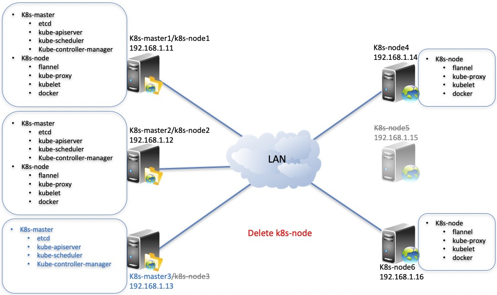

# Operation and Maintenance

<br>

If you have four servers, kubernetes master software is installed on the three servers (192.168.1.11, 192.168.1.12, 192.168.1.13), and kubernetes node software is installed on the three servers (192.168.1.11, 192.168.1.12, 192.168.1.13, 192.168.1.14). <br>
<table>
<tr><td><b>IP Address</b></td><td><b>Role</b></td><td><b>OS Version</b></td><td><b>Root Password</b></td></tr>
<tr><td>192.168.1.11</td><td>k8s-master,k8s-node</td><td>CentOS Linux release 7 or Red Hat Enterprise Linux(RHEL) 7</td><td>cloudnativer</td></tr>
<tr><td>192.168.1.12</td><td>k8s-master,k8s-node</td><td>CentOS Linux release 7 or Red Hat Enterprise Linux(RHEL) 7</td><td>cloudnativer</td></tr>
<tr><td>192.168.1.13</td><td>k8s-master,k8s-node</td><td>CentOS Linux release 7 or Red Hat Enterprise Linux(RHEL) 7</td><td>cloudnativer</td></tr>
<tr><td>192.168.1.14</td><td>k8s-node</td><td>CentOS Linux release 7 or Red Hat Enterprise Linux(RHEL) 7</td><td>cloudnativer</td></tr>
</table>

The current kubernetes cluster architecture is as follows:


<br>

Next, we will carry out daily operation and maintenance operations such as add-k8s node, delete k8s-node, delete k8s-master and rebuild k8s-master.

<br>

## Add k8s-node to k8s cluster

<br>
You will install two servers (192.168.1.15 and 192.168.1.16) as k8s-node and join the kubernetets cluster.
<table>
<tr><td><b>IP Address</b></td><td><b>Role</b></td><td><b>OS Version</b></td><td><b>Root Password</b></td></tr>
<tr><td>192.168.1.11</td><td>k8s-master,k8s-node</td><td>CentOS Linux release 7 or Red Hat Enterprise Linux(RHEL) 7</td><td>cloudnativer</td></tr>
<tr><td>192.168.1.12</td><td>k8s-master,k8s-node</td><td>CentOS Linux release 7 or Red Hat Enterprise Linux(RHEL) 7</td><td>cloudnativer</td></tr>
<tr><td>192.168.1.13</td><td>k8s-master,k8s-node</td><td>CentOS Linux release 7 or Red Hat Enterprise Linux(RHEL) 7</td><td>cloudnativer</td></tr>
<tr><td>192.168.1.14</td><td>k8s-node</td><td>CentOS Linux release 7 or Red Hat Enterprise Linux(RHEL) 7</td><td>cloudnativer</td></tr>
<tr><td><b>192.168.1.15</b></td><td>k8s-node</td><td>CentOS Linux release 7 or Red Hat Enterprise Linux(RHEL) 7</td><td>cloudnativer</td></tr>
<tr><td><b>192.168.1.16</b></td><td>k8s-node</td><td>CentOS Linux release 7 or Red Hat Enterprise Linux(RHEL) 7</td><td>cloudnativer</td></tr>
</table>

Select any k8s-master server, and execute the following command on it:<br>

```
# kube-install -opt addnode -node "192.168.1.15,192.168.1.16" -sshpwd "cloudnativer" -ostype "centos7"
```

Notice: Please make sure that the `-ostype` flag you entered is correct, only support `rhel7`, `rhel8`, `centos7`, `centos8`, `suse15` these types of "ostype".<br>
If you need to specify the directory path to add Kubernetes node, you can set it using the `-softdir` parameter.<br>
In addition, you can also add node through the pre written configuration file. Click here to <a href="docs/cfg0.7.md">see more detailed configuration file introduction</a>.<br>

<br>

The architecture after installation is shown in the following figure:


<br>

## Delete k8s-node from k8s cluster

<br>
You will delete the two k8s-nodes (192.168.1.15 and 192.168.1.16) from the kubernetets cluster.
Select any k8s-master server, and execute the following command on it:<br>

```
# kube-install -opt delnode -node "192.168.1.13,192.168.1.15" -sshpwd "cloudnativer"
```

Notice: If you specify the `-softdir` parameter value during the installation or addnode operation, please specify the same `-softdir` parameter value during the delnode operation.<br>
In addition, you can also delete node through the pre written configuration file. Click here to <a href="docs/cfg0.7.md">see more detailed configuration file introduction</a>.<br>

The architecture after installation is shown in the following figure:



<br>

## Delete k8s-master from k8s cluster

<br>
You will Delete the k8s-master (192.168.1.13) from the kubernetets cluster.
Select any k8s-master server, and execute the following command on it:<br>

```
# kube-install -opt delmaster -master "192.168.1.13" -sshpwd "cloudnativer"
```

Notice: If you specify the `-softdir` parameter value during the installation operation, please specify the same `-softdir` parameter value during the delmaster operation.<br>
In addition, you can also delete master through the pre written configuration file. Click here to <a href="docs/cfg0.7.md">see more detailed configuration file introduction</a>.<br>

The architecture after installation is shown in the following figure:


<br>

## Rebuild k8s-master to k8s cluster

<br>
You will rebuild the damaged k8s-master (192.168.1.13) in the kubernetets cluster.
Select any k8s-master server, and execute the following command on it:<br>

```
# kube-install -opt rebuildmaster -rebuildmaster "192.168.1.13" -sshpwd "cloudnativer" -ostype "centos7"
```

Notice: Please make sure that the `-ostype` flag you entered is correct, only support `rhel7`, `rhel8`, `centos7`, `centos8`, `suse15` these types of "ostype".<br>
Notice: If you specify the `-softdir` parameter value during the installation operation, please specify the same `-softdir` parameter value during the rebuildmaster operation.<br>
In addition, you can also rebuild master through the pre written configuration file. Click here to <a href="docs/cfg0.7.md">see more detailed configuration file introduction</a>.<br>

<br>

The architecture after installation is shown in the following figure:


<br>


## Uninstall kubernetes cluster

<br>
You will uninstall kubernetets cluster.
Select any k8s-master server, and execute the following command on it:<br>

```
# kube-install -opt uninstall -master "192.168.1.11,192.168.1.12,192.168.1.13" -node "192.168.1.11,192.168.1.12,192.168.1.13,192.168.1.14" -sshpwd "cloudnativer"
```

Notice: If you specify the `-softdir` parameter value during the installation operation, please specify the same `-softdir` parameter value during the uninstall operation.<br>
In addition, you can also uninstall the Kubernetes cluster through the prewritten configuration file. Click here to <a href="docs/cfg0.7.md">see more detailed configuration file introduction</a>.<br>


<br>
<br>
<br>
