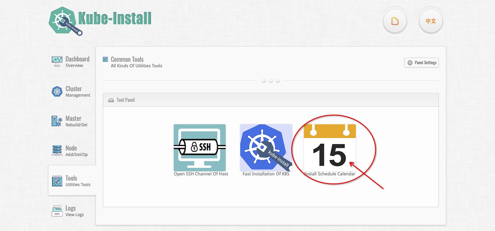
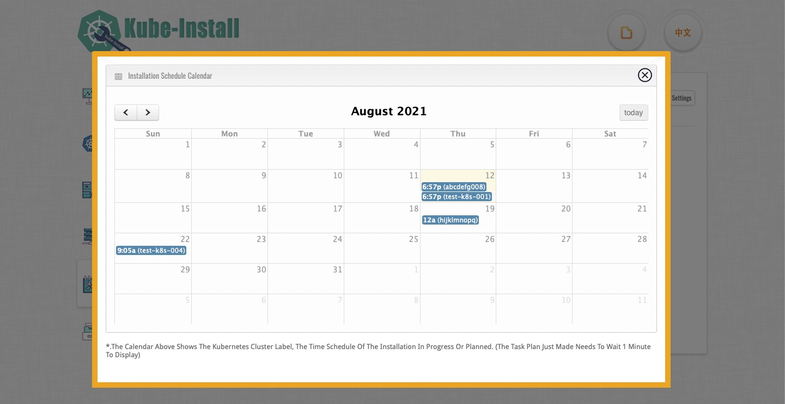

# view all installation task plan calendars

 

Using the schedule widget, you can also view all installation task plan calendars. You can click the `Tools` button to view Utilities Tools.

Click the `Install Schedule Calendar` button to view Install Schedule Calendar Tools.

The calendar above shows the kubernetes cluster label, the time schedule of the installation in progress or planned. 

 

Notice: The task plan just made needs to wait 1 minute to display!

 
 

