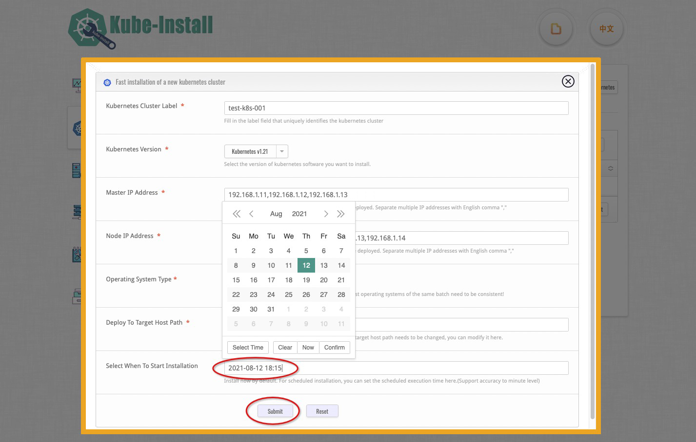

# 使用Web管理平台安装Kubernetes集群

<br>
你也可以通过kube-install的Web管理平台来安装kubernetes集群。kube-install的Web管理平台具备SSH打通、定时安装部署、Node扩容、Master修复、集群卸载等强大的功能，你可以在Web管理平台上获得更好的安装体验。
<br>

## 运行kube-install的Web管理服务

首先，你需要执行`kube-install -init`命令初始化系统环境(如果前面已经初始化过了可以跳过)，然后执行`systemctl start kube-install`命令来运行kube-install的Web管理平台服务。

```
# cd /root/kube-install/
# ./kube-install -init -ostype "centos7"
#
# systemctl start kube-install.service
#
# systemctl status kube-install.service
  ● kube-install.service - kube-install One click fast installation of highly available kubernetes cluster.
     Loaded: loaded (/etc/systemd/system/kube-install.service; disabled; vendor preset: disabled)
     Active: active (running) since Fri 2021-08-20 14:30:55 CST; 21min ago
       Docs: https://cloudnativer.github.io/
   Main PID: 2768 (kube-install)
     CGroup: /system.slice/kube-install.service
             └─2768 /go/src/kube-install/kube-install -daemon
   ...

```

此时，你就可以使用网页浏览器打开`http://kube-install源安装机IP:9080`，访问kube-install的Web管理平台了。
<br>
注意：kube-install的Web管理平台服务默认监听`TCP 9080`。如果你想修改这个监听地址的话，可以通过修改`/etc/systemd/system/kube-install.service`文件中的`kube-install -daemon -listen ip:port`参数来进行设置，<a href="docs/systemd0.7.md">点击这里可以查看详细文档</a>！<br>

## 打通到目标主机的SSH通道

在你开始给目标主机安装kubernetes集群之前，请先打通kube-install源安装机本地到目标主机的SSH免密通道。你可以自己手工打通到目标主机的SSH通道，也可以通过执行`kube-install -exec sshcontrol`命令来一键打通：<br>

```
kube-install -exec sshcontrol -sship "192.168.1.11,192.168.1.12,192.168.1.13,192.168.1.14" -sshpass "cloudnativer"
```

还可以点击Web管理平台右上角的`Open SSH Channel of Host`按钮来进行打通，<a href="docs/webssh0.7.md">点击这里可以查看更加详细的文档</a>。


<br>
<br>

## 在表单中填写安装参数

<br>
然后点击右上角的`Install Kubernetes`按钮：


在弹出的安装表单窗口中填写好安装所需的参数信息：


说明：

* 请选择好你需要安装的Kubernetes版本，目前kube-install支持v1.17~1.24版本的Kubernetes安装部署，其他版本的Kubernete暂未进行验证。
* 请选择好你需要安装的CNI插件，目前kube-install支持`Flannel`、`Calico`、`Kube-router`、`Weave`、`Cilium`等CNI插件类型。如果需要安装`Cilium`，请将Linux内核升级到4.9或以上版本。
* 请选择好你的操作系统环境。由于低版本的`Centos 7`和`RHEL 7`可能缺少内核模块，kube-install对`Centos 7`和`RHEL 7`操作系统内核的提供了自动升级到4.19的功能，你可以选择使用此功能，也可能自己手工优化操作系统内核。

<br>

注意：如果不设置定时安装的话，默认为立即开始安装。你如果想进行定时安装，也可以在下方的选择定时安装的日期与时间。

<br>
<br>

## 开始kubernetes集群的安装

点击`Submit`开始全自动安装过程。



注意：如果你设置了定时安装的话，你还可以在工具菜单中通过日程工具查看定时安装日历，<a href="schedule0.7.md">点击这里查看日程工具的使用说明</a>。<br>


你还可以点击右侧的`Install Log`按钮实时查看安装部署的过程日志信息。<br>

等待差不多15分钟时间，kube-install会自动完成kubernetes集群的安装部署。

<br>
<br>
<br>
