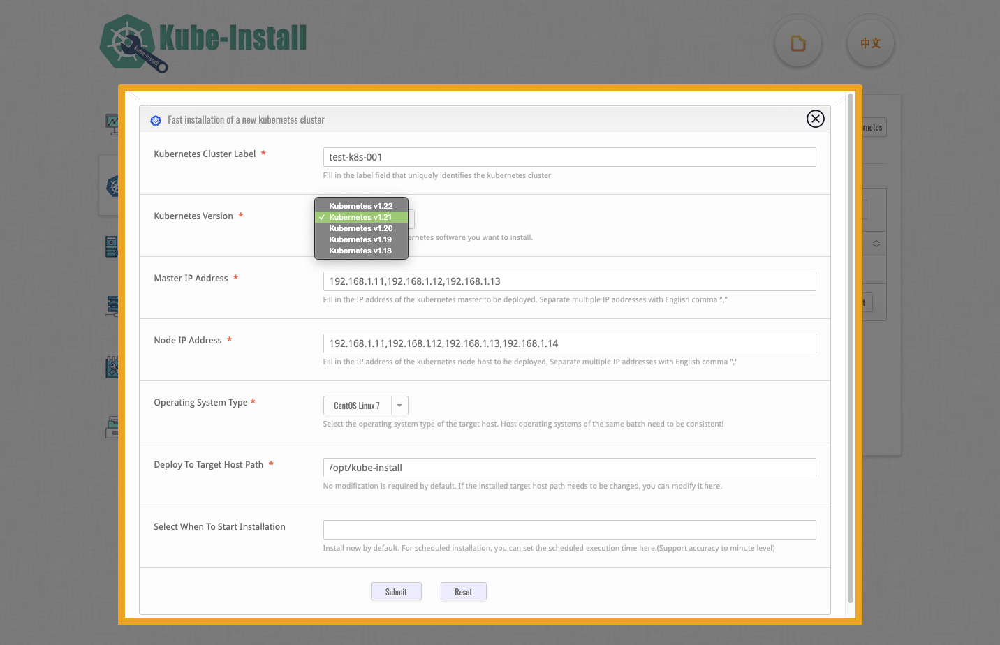

# Use the web platform to install

<br>You can also install the Kubernetes cluster on the Kube-Install web platform. 

<br>

## Run the web management service

First, you need to execute the 'kube-install -init' command to initialize the system environment (you can skip if you have already initialized earlier), and then execute the 'systemctl start kube-install' command to run the web management platform service of kube-install.

```
# cd /root/kube-install/
# ./kube-install -init -ostype "centos7"
#
# systemctl start kube-install.service
#
# systemctl status kube-install.service
  ● kube-install.service - kube-install One click fast installation of highly available kubernetes cluster.
     Loaded: loaded (/etc/systemd/system/kube-install.service; disabled; vendor preset: disabled)
     Active: active (running) since Fri 2021-08-20 14:30:55 CST; 21min ago
       Docs: https://cloudnativer.github.io/
   Main PID: 2768 (kube-install)
     CGroup: /system.slice/kube-install.service
             └─2768 /go/src/kube-install/kube-install -daemon
   ...

```

Now, you can open it with a web browser `http://kube-install_IP:9080`, view kube-nstall web platform.
<br>
Notice: kube-install web platform service listens to `TCP 9080` by default. If you want to modify the listening address, you can set it by modifying the `kube-install -daemon -listen IP:port` parameter in the `/etc/systemd/system/kube-install.service` file.

## Open the SSH password free channel to the target host

Before starting the installation, please open the SSH password free channel from localhost to the target host.You can use the `kube-install -exec sshcontrol` command to SSH through, or click the `Open SSH Channel of Host` button in the upper right corner to SSH through.
<br>
use the `kube-install -exec sshcontrol` command to SSH through.

```
kube-install -exec sshcontrol -sship "192.168.1.11,192.168.1.12,192.168.1.13,192.168.1.14" -sshpass "cloudnativer"
```

Or click the `Open SSH Channel of Host` button in the upper right corner to SSH through.


Here is the process of SSH connection, <a href="webssh0.7.md">click here to view more details</a> !<br>

<br>
<br>

## Fill in the installation parameters in the form

Then click the `Install Kubernetes` button in the upper right corner to SSH through.<br>


Fill in relevant installation parameters in the pop-up form:<br>



explain:

* Please select the version of kubernetes you need to install. At present, 'Kube install' supports the installation and deployment of kubernetes v1.17 to 1.24. Other versions of kubernetes have not been verified yet.
* Please select the CNI plug-ins you need to install. At present, 'kube-install' supports CNI plug-ins such as flannel, calico, Kube router, weave and cilium. If you need to install "cilium", please upgrade the Linux kernel to version 4.9 or above.
* Please select your operating system environment. Since the lower versions of CentOS 7 and RedHat 7 may lack kernel modules, 'Kube install' provides the function of automatically upgrading the operating system kernels of CentOS 7 and rhel7 to 4.19. You can choose to use this function or manually optimize the operating system kernel yourself.

<br>

Notice: The default is to start the installation immediately. You can also set an installation time for scheduled installation.

<br>
<br>

## Start the installation of kubernetes

Click the `Submit` button to start the automatic installation.<br>


Using the schedule widget, you can also view all installation task plan calendars, <a href="schedule0.7.md">click here to view more details</a> !<br>


You can also view the installation process log by clicking the `Install Log` button.<br>

Wait about 15 minutes and the installation will be completed automatically in the background. 

<br>
<br>
<br>
