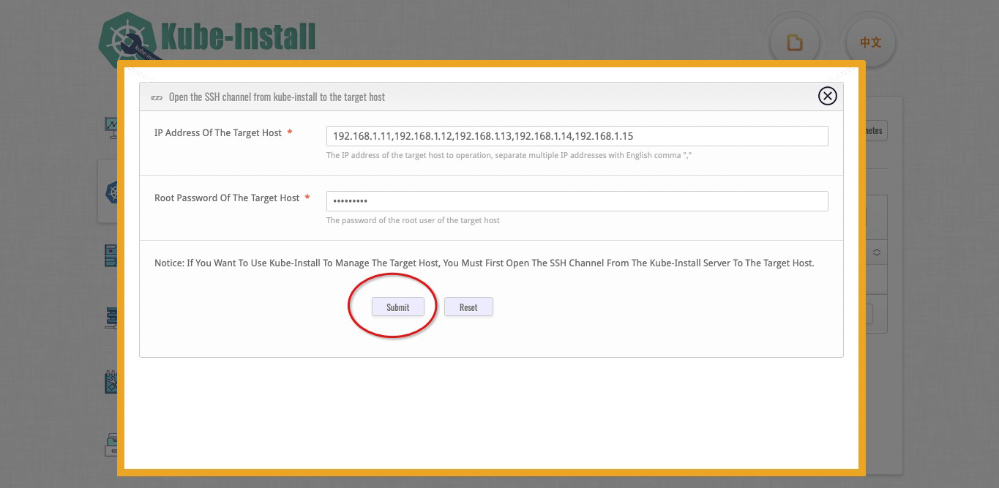

# open the SSH password free channel

<br>

You can use the `kube-install -exec sshcontrol` command to SSH through, or click the `Open SSH Channel of Host` button in the upper right corner to SSH through.

<br>

## use the Web platform to SSH through.

You can click the `Open SSH Channel of Host` button in the upper right corner to SSH through.


Enter the IP address of the target host. Multiple hosts are separated by English commas. And Enter the root account password of the target host.



Click `Submit` button to open SSH channel automatically.


<br>
<br>

## use the CLI command to SSH through.


use the `kube-install -exec sshcontrol` command to SSH through.

```
kube-install -exec sshcontrol -sship "192.168.1.11,192.168.1.12,192.168.1.13,192.168.1.14" -sshpass "cloudnativer"
```

<br>
Notice: Before using the web platform for installation, please open the SSH password free channel from localhost to the target host.

<br>
<br>

