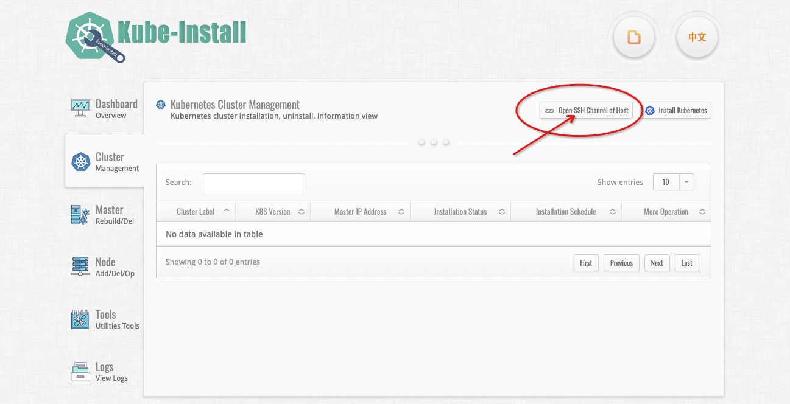
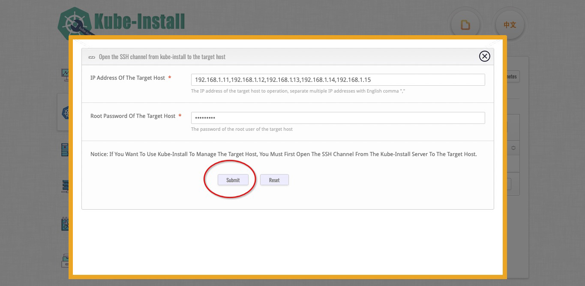
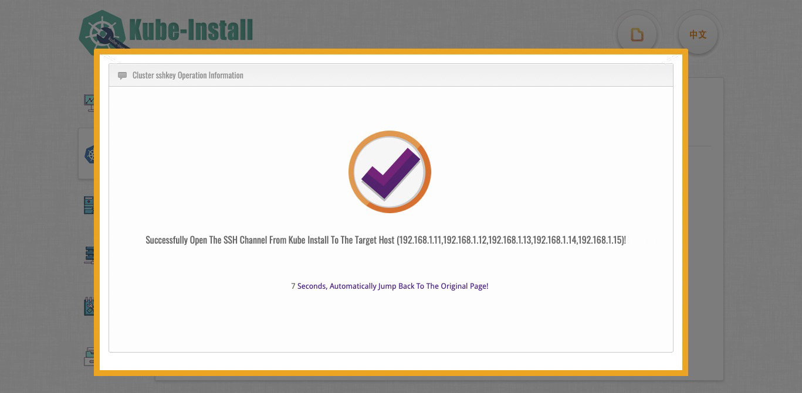

# Open the SSH password free channel

<br>

You can use the `kube-install -exec sshcontrol` command to SSH through, or click the `Open SSH Channel of Host` button in the upper right corner to SSH through.

<br>

## Use the Web platform to SSH through.

You can click the `Open SSH Channel of Host` button in the upper right corner to SSH through.



Enter the IP address of the target host. Multiple hosts are separated by English commas. And Enter the root account password of the target host.



Click `Submit` button to open SSH channel automatically.



<br>
<br>

## Use the CLI command to SSH through.


use the `kube-install -exec sshcontrol` command to SSH through.

```
kube-install -exec sshcontrol -sship "192.168.1.11,192.168.1.12,192.168.1.13,192.168.1.14" -sshport 22 -sshpass "cloudnativer"

```

<br>
Notice: Before starting the installation, please open the SSH password free channel from localhost to the target host.

<br>
<br>

## Solutions to SSH channel opening failure


You can try to open the SSH channel again after executing the following command on the target host:

```
# sudo sed -i "/PermitRootLogin/d" /etc/ssh/sshd_config
# sudo sh -c "echo 'PermitRootLogin yes' >> /etc/ssh/sshd_config" 
# sudo sed -i "/StrictHostKeyChecking/s/^#//; /StrictHostKeyChecking/s/ask/no/" /etc/ssh/ssh_config
# sudo systemctl restart sshd
```

Or you can use "root" user to manually open the SSH channel from the local host to the target host.

<br>
<br>
<br>
